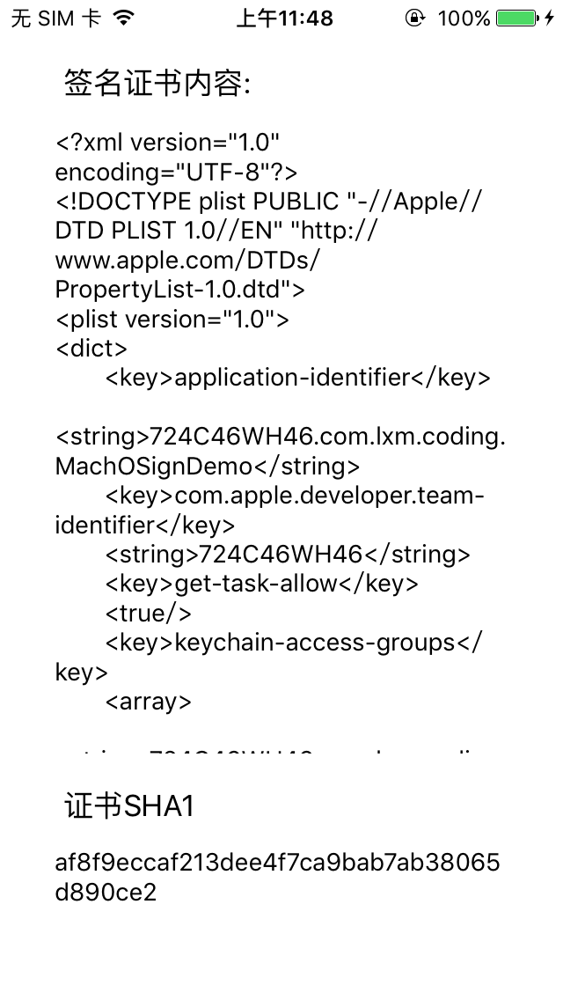

# MachOSign

get Signature in MachO file

Codes are copy from the `Security` library which Apple opensource in [here](https://opensource.apple.com) . Codes are at `Security/Tool` / `codesign.c` in detail.

## Usage

Use `MachOSign` to get the signature info in the MachO file . 

The return of `loadSignature` is a `NSDictionary` which contains the signature certificate detail info and the SHA1 of the signature  certificate.

Demo :

